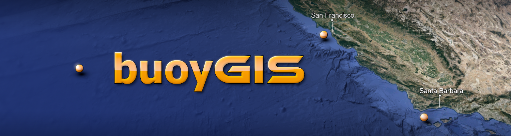

# California Surf Data

-------------------------------------------------------

#### Scraping, storing, & analyzing buoy data

Webscraping and cleaning buoy data from NOAA daily, with plans for future API access and developing unique surf forecasts. Emphasis on visualization around key surf zones of Santa Barbara & San Francisco.
Currently only pulling from buoys 46054 (Santa Barbara West), 46026 (San Francisco), and 46059 (California Buoy).